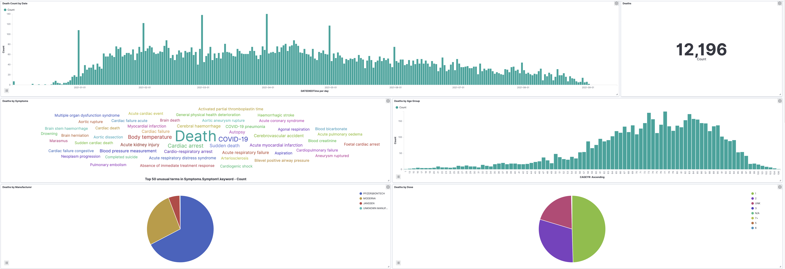

# Overview
An attempt to catalog and dive deeper into the VAERS data. I downloaded it 1 month at a time because 
it was giving me too many rows to return errors, max is 10,000. All I was trying to do is get DEATH from the 
Covid-19 Vaccine from 2021 and depending on the query it was between 20-50,000 results. So I split up the query 
by date, combined them all, and ended up with ~5000 deaths which is less than if you just download it all as CSV. 

The data seems to change constantly, and I mean it decrements, which should be impossible. I had 1 query that was 
returning ~21,000 results, and then 5min later it was return 18,000 results. This combined data should have been 
all results, but it is clearly a tiny subset. 

# Conclusion
  * The data is broken. Raw data shows 7390 rows. Rows with Vaers ID = 5457. 
  * It does appear that something like 85-90% had no current illness. 
  * mRNA is the most deadly by far
  

